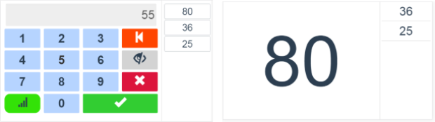
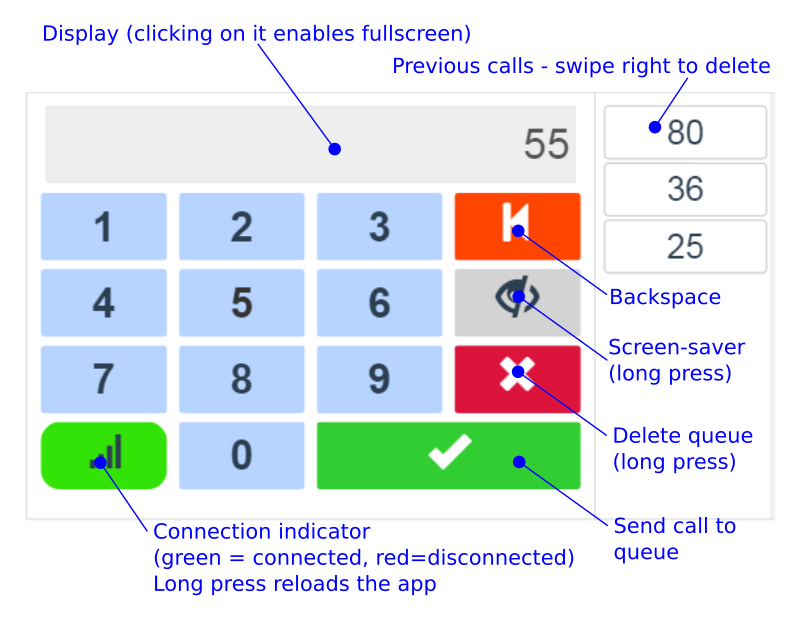

==========
Wait-a-bit
==========

.. image:: https://img.shields.io/pypi/v/waitabit.svg
        :target: https://pypi.python.org/pypi/waitabit

.. image:: https://img.shields.io/travis/jnevrly/waitabit.svg
        :target: https://travis-ci.org/jnevrly/waitabit

.. image:: https://pyup.io/repos/github/jnevrly/waitabit/shield.svg
     :target: https://pyup.io/repos/github/jnevrly/waitabit/
     :alt: Updates

The simplest waiting line management app - one UI to enter an order number, one
dashboard to display the number (plus a history of previous numbers).

The numbers are expected to be assigned separately (manually).

   UI panel for number input and Dashboard displaying the call queue.

Implementation is a HTML5 and a simple server (Python/Asyncio)
serving both UI screen and the dashboards.

UI screen and dashboards are synchronized over websockets, system allows many
UI screens and many dashboards, but the queue is shared.

UI panel is optimized for a tablet/touchscreen - with swipes and long-press
events.

The system has a screen-saver/session timeout option which would dim the
dashboard and erase the queue after a selected time, to prevent screen burn-in.
Screen-saver can be also enabled manually from the UI. Any new call input
deactivates the screen-saver.

Requirements
------------

* Python 3.5+
* Chrome/Chromium browser (desktop or mobile) - it's probably working on other
  browsers as well, but was not tested.

Installation
------------

Just install the package from GitHub (assuming pip is for Python3)::

    $ sudo pip install git+https://github.com/calcite/waitabit.git

Usage
-----

Running the server
++++++++++++++++++

The server is started from command-line::

    $ waitabit --host 127.0.0.1 --port 8080 --queue_size 6 --session_timeout 3600

The server command has several options apart of mandatory ``host``/``port``:

* ``queue_size`` is the length of the order call history, which is displayed
  on the dashboard.

* ``session_timeout`` is the timeout (in seconds) after which the session
  is closed by clearing the queue and activating the screen-saver.

  Set to 0 to prevent session timeout/screen-saver activation.

Help is also available with ``waitabit --help``.

Using the app
+++++++++++++

The server provides a web-page which links to the UI panel and Dashboard screen.

The dashboard screen doesn't need any user operation, it's just displaying
the queue.

The user input screen is simple, the basic usage is explained
on the image below:

Development
-----------

The backend is a standard python package, so you can install it with the usual::

    $ python setup.py develop

The frontend is written in `Vue.js`_ and can be run with the webpack development
server. In the ``waitabit\frontend`` folder, run::

    $ npm install
    $ npm run dev

It will serve the developer view on ``localhost:8080``, but it expects to have
a running backend running on port 8000, so don't forget to have one instance of
waitabit running when starting the npm dev server.

Currently there is no CI set up for this project, so if you wan't to bundle
the distributable JavaScript together with the waitabit python package (as are
all the releases), you need to build the distributable package by running::

    $ npm run build

Licence
-------

* Free software: MIT license

Credits
---------

The ding notification sound is from `Corsica_s`_

The click sound is from `kwahmah_02`_.

The HTML5 part was created with the amazing `Vue.js`_ framework.

This package was created with Cookiecutter_ and the `audreyr/cookiecutter-pypackage`_ project template.

.. _Cookiecutter: https://github.com/audreyr/cookiecutter
.. _`audreyr/cookiecutter-pypackage`: https://github.com/audreyr/cookiecutter-pypackage
.. _`Corsica_S`: https://freesound.org/people/Corsica_S/sounds/91926/
.. _`kwahmah_02`: https://freesound.org/people/kwahmah_02/sounds/256116/
.. _`Vue.js`: https://vuejs.org/
